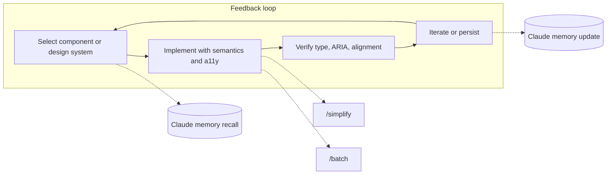
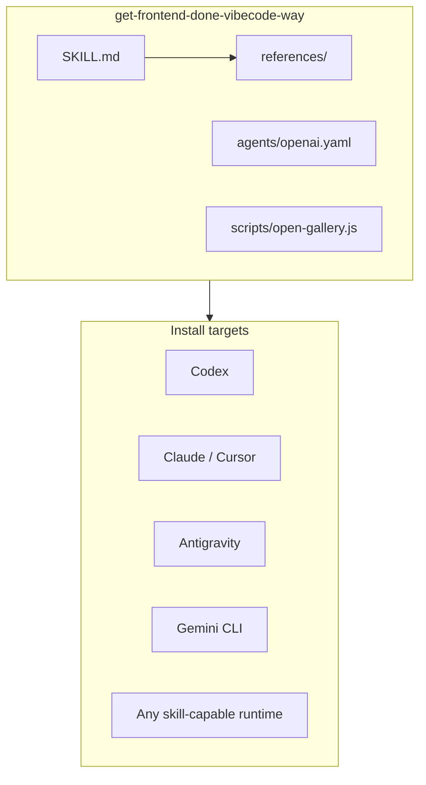

# Get frontend done — vibecode way

[](https://github.com/Hkshoonya/Get-frontend-done-vibecode-way/stargazers)
[](https://github.com/Hkshoonya/Get-frontend-done-vibecode-way/network)
[](CONTRIBUTING.md)

**A CLI-installable AI skill for front-end design and UI**, grounded in [The Component Gallery](https://component.gallery/) — 60 components, 95+ design systems, 2,676 examples. Use it with **Claude**, **Codex**, **Antigravity**, **Gemini CLI**, or any skill-capable agent to build and verify interfaces in a consistent, feedback-loop way.

**PRs and issues welcome** — see [CONTRIBUTING.md](CONTRIBUTING.md). Star the repo if it helps you; it helps others discover it.

---

## Description

This skill turns [component.gallery](https://component.gallery/) into a **canonical reference** that AI models can load when building or reviewing UI. It defines a repeatable **Select → Implement → Verify → Iterate** loop, optional **Claude memory** for project design-system and conventions, **/simplify** and **/batch** (Cursor) for quality and migrations, and **optional GSD (Get Shit Done)** integration. References are snapshot with clear dates and refresh instructions so the skill works offline and stays maintainable.

**Special thanks** to [inbn/component-gallery](https://github.com/inbn/component-gallery) — the Astro + Airtable source behind component.gallery.

---

## Architecture

### Feedback-loop workflow

Agents using this skill follow a single loop; memory and Cursor commands plug in where supported.



### Skill layout and install targets



| Layer | Contents |
|-------|----------|
| **SKILL.md** | When to use, feedback loop, GSD integration, Claude memory (surgical), /simplify & /batch, Install, quick ref |
| **references/** | Snapshot of 60 components and curated design systems (date + refresh note) |
| **agents/** | Per-tool UI metadata: Codex, Claude, Cursor, Gemini CLI, Antigravity (see `agents/README.md`) |
| **scripts/** | Optional: open component.gallery or print URLs |

---

## What’s inside

- **60 UI components** — Accordion, Alert, Badge, Button, Card, Carousel, Modal, Tabs, Toast, Tree view, and 50 more, with aliases and short descriptions.
- **95+ design systems** — Curated list (React, Vue, Web Components, Tailwind, etc.) with tech and features; link to full list on component.gallery.
- **Feedback loop** — Select (with optional memory recall) → Implement (/simplify, /batch) → Verify → Iterate (with optional memory update).
- **GSD integration** — Optional use of gsd-phase-researcher, gsd-planner, gsd-executor, gsd-verifier; skill works standalone.
- **Install once, use everywhere** — Same skill folder for Codex, Claude, Antigravity, Gemini CLI, or generic copy-into-skills-root.

---

## Quick install

| Platform | Command |
|----------|---------|
| **Codex** | `scripts/install-skill-from-github.py --repo Hkshoonya/Get-frontend-done-vibecode-way --path get-frontend-done-vibecode-way` |
| **Claude / Cursor** | `cp -r get-frontend-done-vibecode-way ~/.agents/skills/` |
| **Antigravity** | `cp -r get-frontend-done-vibecode-way ~/.gemini/antigravity/skills/` |
| **Gemini CLI** | `gemini skills install https://github.com/Hkshoonya/Get-frontend-done-vibecode-way.git` |

Full install options (including symlink and workspace paths) are in **get-frontend-done-vibecode-way/SKILL.md** under *Install*.

---

## Repo structure

```
.
├── README.md                           # This file — description, architecture, install, contributing
├── CONTRIBUTING.md                     # How to open PRs and issues
├── .gitignore
├── .github/
│   ├── PULL_REQUEST_TEMPLATE.md       # PR template
│   └── ISSUE_TEMPLATE/                 # Bug report, feature request
└── get-frontend-done-vibecode-way/     # The skill (copy or install this folder)
    ├── SKILL.md                        # Main skill: loop, memory, /simplify, /batch, GSD, Install
    ├── demo/                           # Test-and-use demo (Button, Card, Skip link)
    │   ├── index.html
    │   └── README.md
    ├── references/
    │   ├── components.md               # 60 components (snapshot)
    │   └── design-systems.md           # Curated design systems (snapshot)
    ├── agents/
    │   ├── README.md                   # Per-tool metadata overview
    │   ├── openai.yaml                 # Codex
    │   ├── claude.yaml                 # Claude Code
    │   ├── cursor.yaml                 # Cursor
    │   ├── gemini.yaml                 # Gemini CLI
    │   └── antigravity.yaml            # Antigravity
    └── scripts/
        └── open-gallery.js             # Open component.gallery or print URLs
```

---

## Contributing and making it famous

- **First-time repo setup** — Add topics and labels so the repo is discoverable and issue templates work: see [.github/SETUP-GITHUB.md](.github/SETUP-GITHUB.md).
- **Open a PR** — Fixes, new references, demo improvements, or docs. See [CONTRIBUTING.md](CONTRIBUTING.md) and the [PR template](.github/PULL_REQUEST_TEMPLATE.md).
- **Open an issue** — Bug or feature idea? Use [Issues](https://github.com/Hkshoonya/Get-frontend-done-vibecode-way/issues); templates are provided.
- **Star the repo** — Stars help others find the skill on GitHub.
- **Share** — Use [SHARE.md](SHARE.md) for ready-made post copy and places to share. Tweet, blog, or add to a list (e.g. “AI coding skills”, “Component Gallery”, “Claude / Cursor / Gemini skills”). The skill follows the [SKILL.md / Agent Skills](https://agentskills.io) format used by Claude Code, Cursor, Codex, Gemini CLI, and more.
- **Add topics on GitHub** — On the repo page, click the gear next to “About” and add topics such as: `skill`, `component-gallery`, `claude`, `cursor`, `codex`, `gemini`, `antigravity`, `design-systems`, `ui-components`, `frontend`, `accessibility`.

## Links

- **Component Gallery (live)** — [component.gallery](https://component.gallery/)
- **Source project (attribution)** — [inbn/component-gallery](https://github.com/inbn/component-gallery)
- **This repo** — [Hkshoonya/Get-frontend-done-vibecode-way](https://github.com/Hkshoonya/Get-frontend-done-vibecode-way)
